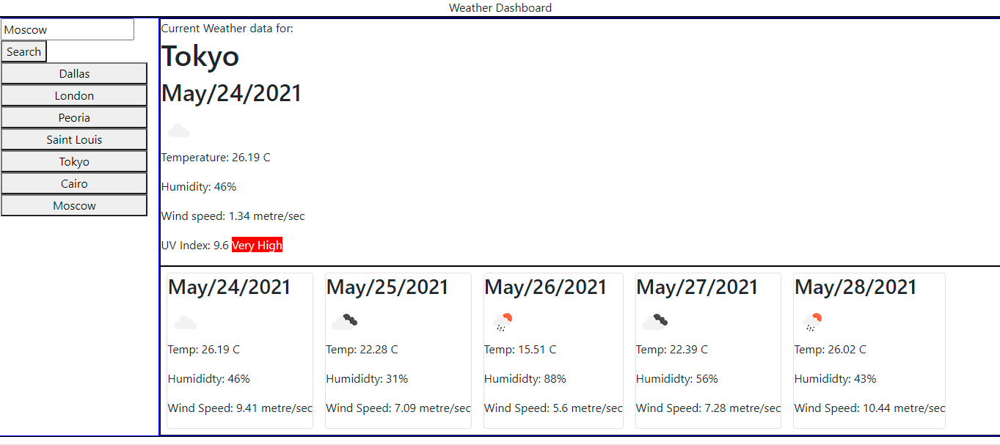

# Weather-Dashboard

This application is diplays weather information for a given city.

## Usage

Link to the application: https://patrbraun.github.io/Weather-Dashboard/

Enter a city name and click "search" in the top left of the screen.

This will display current weather and a five day forecaste for the given city.

Past searches will be listed below the search box, clicking on one will display that search's weather data again.

